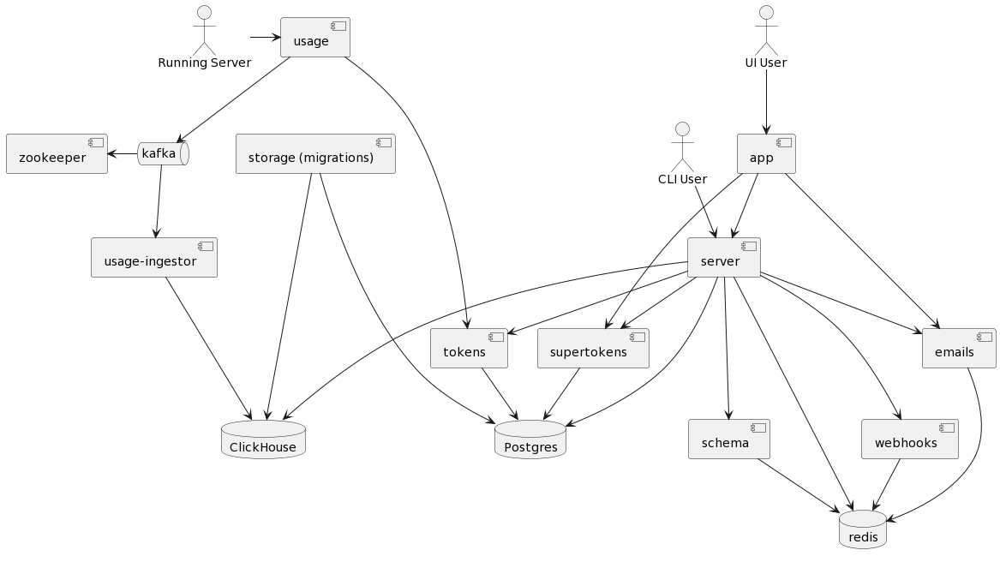

# graphql-hive-helm

This is a self hosted version of GraphQL Hive. It is intended for development and testing purposes only.
It is not recommended to use this in production.

Based on: https://github.com/kamilkisiela/graphql-hive/blob/main/docker/docker-compose.community.yml


## Components


(Source: https://github.com/kamilkisiela/graphql-hive/blob/main/docs/architecture.puml)

# Deploy helm to k8s

```bash
helm upgrade --install registry ./hive/ --namespace hive --create-namespace
```

# Test helm chart

## lint

```bash
helm lint hive/
```

## template

```bash
helm template registry ./hive/ --debug
```

## install dry-run

```bash
helm install --dry-run registry ./hive/
```